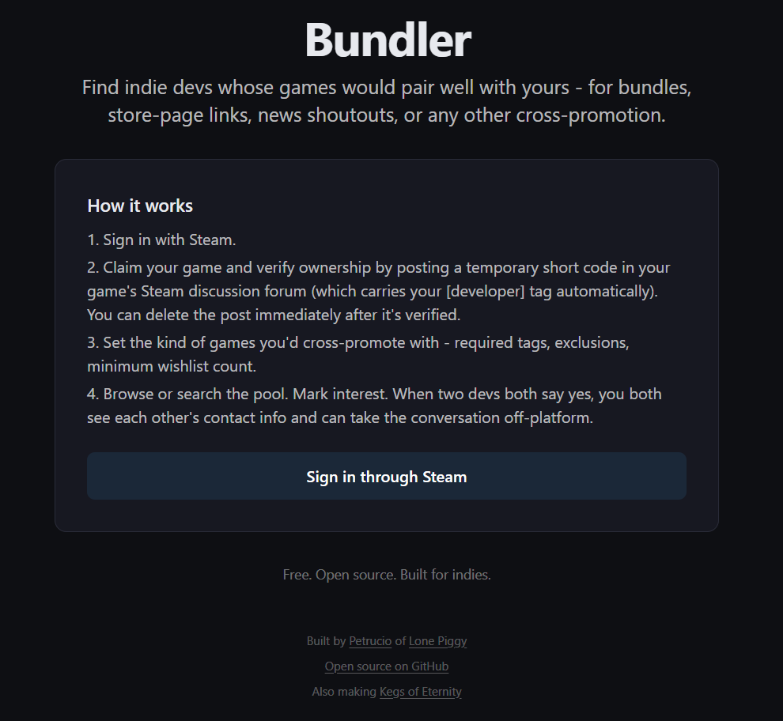
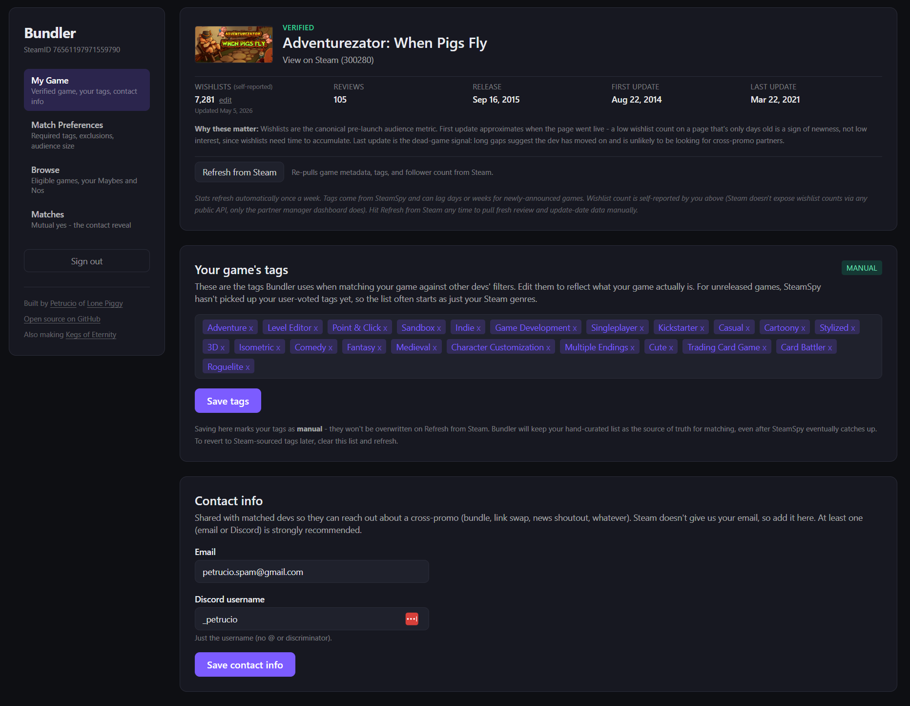
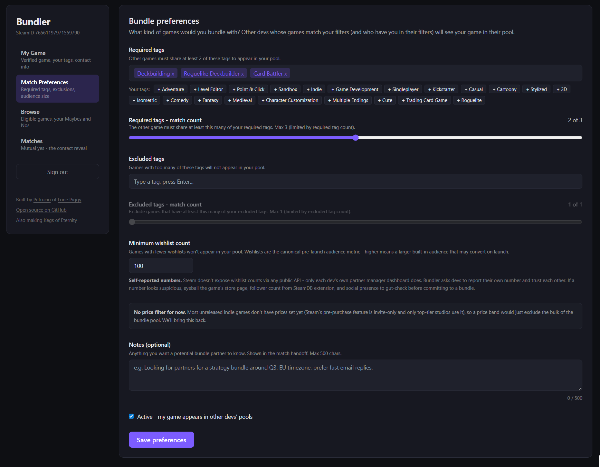
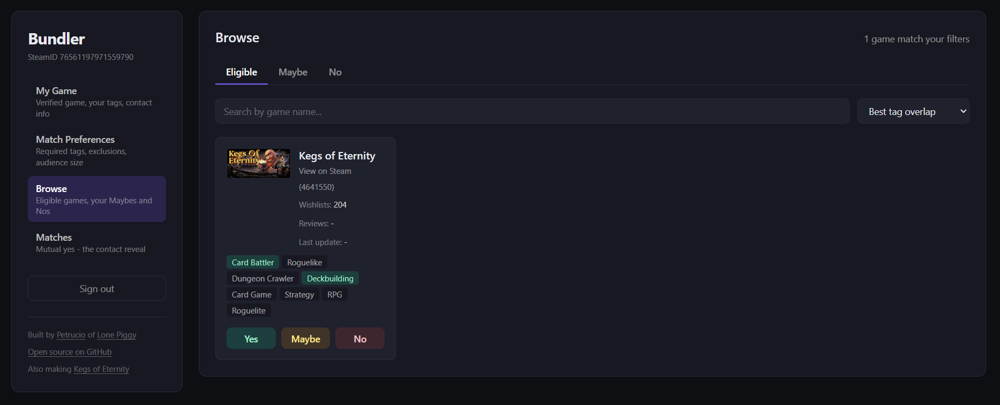
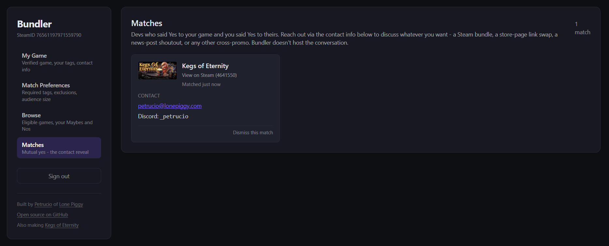

# Bundler

Cross-promo matchmaking for indie devs on Steam. Sign in with Steam, claim your
game, set your match preferences, find compatible partners. The name comes from
the canonical use case (Steam bundles), but mutual-yes matches work just as well
for store-page link swaps, news-post shoutouts, or any other cross-promotional
move where two indie devs want to put each other's games in front of each other's
audiences.

Open source under MIT. See `LICENSE`.

---

## AS-IS, NO WARRANTY

**This software is provided AS-IS, with no guarantees about uptime, accuracy of
matches, fitness for any purpose, or anything else.** The hosted instance at
bundler.games is a free community service run as a side project by one person.
There is no SLA, no support contract, and no liability for anything
that happens as a result of using it - including but not limited to: missed
bundle opportunities, mistaken matches, exposed contact information, lost data,
or downtime. Use at your own risk. See `LICENSE` for the full legal disclaimer.

If something is broken, file an issue and I'll do my best, but I'm not on the
hook for any consequences.

---

## Tour

**The landing page.** Sign in with Steam, three minutes of setup, you're matching with other indie devs.



**My Game.** Verify your Steam game once via a temporary forum post + the [developer] tag, then track your stats: self-reported wishlist count (Steam doesn't expose these publicly so we trust devs to report), review count, release date, dev activity dates, your hand-curated tag list, and contact info that gets revealed only on mutual matches.



**Match Preferences.** Set what kind of games you'd cross-promote with. Required tags + match count, excluded tags + match count, minimum wishlist threshold, free-text notes shown to matched devs. Smart defaults seeded from your own game's profile.



**Browse.** Mutual filtering surfaces only games that pass your filters AND whose filters you also pass. Yes / Maybe / No per card. Tag chips highlight green when matched against your required list, red when matched against your excluded list.



**Matches.** Mutual yes reveals contact info on both sides. Email + Discord shared, plus the dev's notes. Bundler doesn't host the conversation - you take it from there.



---

## Stack

- Next.js 15 (App Router) + TypeScript
- Tailwind CSS
- Supabase (Postgres + auth-by-our-own-stack via service role)
- iron-session for cookie-based sessions
- Steam OpenID 2.0 for sign-in
- Resend for transactional email (match notifications)
- Deployed on Vercel, DNS via Cloudflare

## Status

Currently functional end-to-end:

- Sign in with Steam
- Claim a Steam game by app ID, verify ownership via a temporary discussion-forum post + [developer] tag check
- Self-report wishlist count, edit your game's tags manually if SteamSpy hasn't picked them up yet
- Set match preferences (required tags, exclusions, minimum wishlist threshold)
- Browse the eligible pool with mutual-filter logic, plus Maybe and No tabs
- Mark Yes / No / Maybe per game; revert No or Maybe; Yes commits to potentially trigger a match
- Mutual yes creates a match; both sides get an email and see each other's contact info on the dashboard
- Weekly cron refreshes review counts, news activity dates, and follower counts (where available)

Planned, not built yet:

- Account deletion / data export endpoint (currently manual via Supabase admin)
- Self-serve API rate limiting (Vercel handles abuse at the platform level for now)
- Block / report flow in the UI (DB schema supports it; UI is the missing piece)
- Multi-dev-per-game, and multi-game-per-dev support (V1 enforces 1 game = 1 dev)

## Local setup

### 1. Prerequisites

Install Node.js 20 LTS or newer.

```
node --version
npm --version
```

### 2. Install dependencies

```
npm install
```

### 3. Create a Supabase project

1. Sign up free at https://supabase.com.
2. Create a new project. Pick the closest region. Save the database password.
3. **Project Settings -> API -> Legacy anon, service_role API keys** tab:
   - `Project URL` -> `NEXT_PUBLIC_SUPABASE_URL`
   - `anon public` key -> `NEXT_PUBLIC_SUPABASE_ANON_KEY`
   - `service_role` secret -> `SUPABASE_SERVICE_ROLE_KEY` (treat as a password, NEVER expose to the browser)
4. **SQL Editor -> New Query**, paste `db/schema.sql`, Run.

### 4. Steam Web API key

Go to https://steamcommunity.com/dev/apikey, sign in, register any domain (use `localhost` for dev). Copy the key into `STEAM_WEB_API_KEY`.

### 5. Generate session and cron secrets

```
node -e "console.log(require('crypto').randomBytes(32).toString('hex'))"
```

Run twice; one for `SESSION_SECRET`, one for `CRON_SECRET`.

### 6. (Optional) Resend for email

Without `RESEND_API_KEY`, match notifications silently no-op (logged but not sent), so the app works fine without email for local dev. To enable: sign up at https://resend.com, verify your domain via DNS records, set `RESEND_API_KEY` and `EMAIL_FROM`.

### 7. Configure env

```
cp .env.example .env.local
```

Fill in the real values.

### 8. Run

```
npm run dev
```

Open http://localhost:3000.

## Deploy to production

### Vercel

1. Push to GitHub.
2. Sign up at https://vercel.com (free tier covers V1).
3. Import the repo. Framework auto-detected.
4. **Settings -> Environment Variables**: add all values from `.env.local`. Use NEW secrets for production - don't reuse local `SESSION_SECRET` or `CRON_SECRET`. Set `NEXT_PUBLIC_BASE_URL` to your production URL.
5. Deploy.

### Cloudflare DNS

1. In Cloudflare for your domain, add the records Vercel asks for in **Project Settings -> Domains**.
2. In Vercel, add the domain. Vercel verifies via DNS.

### Resend domain verification

Add Resend's DNS records (SPF, DKIM) to Cloudflare. Wait 5-15 min for verification. Update `EMAIL_FROM` to your verified address. Redeploy.

## Project structure

```
app/
  page.tsx                         Landing
  dashboard/page.tsx               Main dashboard (sidebar + sections)
  api/
    auth/steam/...                 OpenID sign-in flow
    auth/logout                    Session destroy
    games/claim                    Start a game claim
    games/verify                   Verify via forum post
    games/refresh-data             Re-pull Steam metadata
    games/preferences              GET/PUT bundle preferences
    games/tags                     GET/PUT manual game tags
    games/wishlist                 PUT self-reported wishlist count
    profile                        GET/PUT email + Discord
    browse                         Eligible / Maybe / No pool
    swipes                         POST yes/no/maybe, DELETE to revert
    matches                        GET matches, PATCH to dismiss
    cron/refresh-followers        Weekly refresh of stats (Vercel cron)
    steam-tags                     Proxy for Steam popular-tags list
components/
  dashboard-layout.tsx             Sidebar nav + section routing
  claim-flow.tsx                   Claim/verify states + game stats card
  game-tags-form.tsx               Manual tag editor
  profile-form.tsx                 Email + Discord
  preferences-form.tsx             Match preferences with autocomplete
  browse-view.tsx                  Tabbed browse + cards + actions
  matches-view.tsx                 Match list + contact reveal
lib/
  auth/                            iron-session config, Steam OpenID helpers
  db/                              browse, games, matches, preferences DB layers
  steam/                           Storefront API, news API, follower scrape, forum verify
  email/                           Resend wrapper + match email template
  format.ts                        Deterministic number formatter (avoids SSR/CSR mismatch)
  supabase/                        Browser + server clients
db/
  schema.sql                       Schema, idempotent. Re-run on changes.
```

## Security model

This section is for both contributors and self-hosters. See `SECURITY.md` for vulnerability disclosure.

**Auth:** Sign-in via Steam OpenID 2.0. After verification, we upsert a `users` row keyed by SteamID and store an iron-session cookie containing the SteamID and our internal user UUID. Sessions are signed by `SESSION_SECRET` so cookies can't be forged without the secret. We do NOT use Supabase Auth.

**Database access:** Supabase service-role key is used by all server-side code. It bypasses Row Level Security, which is intentional - we do all auth checks in the application layer rather than in RLS policies. RLS is enabled on every table with no policies as defense in depth: if the anon key ever leaks into a context it shouldn't, anon sees nothing.

**Anon key vs service-role key:** `NEXT_PUBLIC_SUPABASE_ANON_KEY` is public by design (the `NEXT_PUBLIC_` prefix means it's bundled into the browser). `SUPABASE_SERVICE_ROLE_KEY` is server-only - only imported by `lib/supabase/server.ts`, never sent to the browser, never logged.

**Steam OpenID verification:** When Steam redirects back with a `claimed_id`, we POST the response back to Steam with `mode=check_authentication`. Steam confirms the signature is valid before we trust the SteamID. This prevents anyone from forging a Steam sign-in.

**Game claim verification:** Claiming a Steam game requires posting a temporary code in that game's Steam discussion forum. We fetch the post URL, parse the HTML, and check three things in this order: the post URL is on the right app, the post author's SteamID matches the signed-in user, and the post author carries Steam's `commentthread_author_developer` CSS class (only accounts with publisher access to the app get this class). The cryptographic proof is the developer tag - it can't be faked from outside the partner manager.

**Forum scraping:** The forum verifier only fetches Steam community URLs matching a strict regex. It will NOT follow redirects to arbitrary URLs or fetch from other domains. Same for the follower-count scraper, news fetcher, and SteamSpy fetcher.

**Email handling:** We don't verify email addresses. The match recipient is who cares whether the email is right; if it's wrong, the bundle conversation just doesn't happen. Match emails are sent via Resend with explicit HTML escaping in the template.

**Cron endpoint:** `/api/cron/refresh-followers` requires the `Authorization: Bearer ${CRON_SECRET}` header. Vercel automatically sets this header when invoking scheduled functions. Without the header it returns 401.

**No rate limiting at the application layer (yet).** Vercel handles platform-level DoS, but there's nothing stopping an authenticated user from spamming swipes or claim attempts. For V1 with a small userbase this is fine; if abuse becomes real, add Upstash Ratelimit (free tier).

**Account deletion / data export:** Not implemented. For now, contact petrucio@lonepiggy.com to delete your account or export your data. GDPR-relevant for EU devs - building the self-serve flow is on the roadmap.

## Operational notes for self-hosters

If you're running your own Bundler instance (rather than using bundler.games):

- Turn on 2FA for your Vercel and Supabase accounts. The service-role key gives full DB access.
- Use NEW production secrets for `SESSION_SECRET` and `CRON_SECRET`. Don't reuse local dev values.
- Run `npm audit` periodically and update high-severity CVEs. GitHub's Dependabot automates this.
- Monitor Supabase row counts and Vercel function invocations for anomalies. Spam attacks usually show up as sudden spikes in inserts to `swipes` or invocations of `/api/games/claim`.
- Don't log user emails or full SteamIDs unless you genuinely need to debug something.
- If you accept PRs from contributors, treat the review of security-sensitive files (`lib/auth/`, `lib/db/matches.ts`, `lib/email/`, anything in `app/api/`) with extra scrutiny.

## Contributing

See `CONTRIBUTING.md`.

## Reporting security issues

See `SECURITY.md`. Don't open public GitHub issues for security problems.

## License

MIT. See `LICENSE`.

---

## About

Bundler was built by [Petrucio](https://x.com/PetrucioBR) at [Lone Piggy](https://x.com/LonePiggyGames) as part of the launch campaign for [Kegs of Eternity](https://store.steampowered.com/app/4641550), a deck-building roguelite dungeon crawler shipping on Steam in early 2027. The matching pain was real - finding cross-promo partners as a solo dev is mostly Discord DMs and luck - so I built the tool I wished existed.

If Bundler helped you find a partnership that worked out (a bundle, a store-page link swap, a news-post shoutout, anything), [wishlist AND share Kegs of Eternity](https://store.steampowered.com/app/4641550) as payment. If it didn't, do that anyway.

Either way, [follow @LonePiggyGames](https://x.com/LonePiggyGames) for game updates or [open an issue](https://github.com/petrucio-br/bundler/issues) if you've got feedback.

### Hat tip

The original idea came from **hubecube** (developer of [Astronomics](https://store.steampowered.com/app/1975520/Astronomics/)). He floated it as a joke on Discord. I said "hold my beer." Here we are. Thanks Hubecube.
